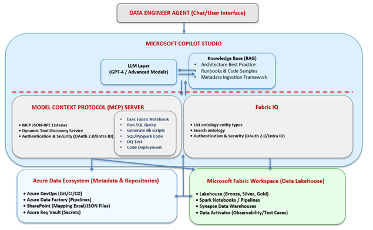

# Enterprise Data Engineering Agent

> 🚀 This agent was developed and participated in the **Microsoft Agents League 2026**, showcasing enterprise data engineering automation and AI-powered capabilities.


---
- **Created By**: Ehab Abdelmonem
- **E-mail:** eaelmoneem@gmail.com

---
# Overview

The **Enterprise Data Engineering Agent** is an AI-powered engineering assistant designed to automate and accelerate enterprise data platform development on **Microsoft Fabric** and the **Azure Data Platform**.

Instead of manually creating pipelines, notebooks, SQL scripts, metadata, unit tests, and deployment artifacts, engineers interact with the platform using natural language. The agent generates enterprise-ready assets while enforcing organizational standards and best practices.

The platform combines:

- Microsoft Copilot Studio
- Retrieval-Augmented Generation (RAG)
- Model Context Protocol (MCP)
- Fabric IQ
- Enterprise Knowledge Base

---

# Problem Statement

Modern data engineering teams spend a significant amount of time on repetitive engineering tasks such as:

- Translating Source-to-Target Mapping documents
- Writing DDL/DML scripts
- Building Bronze, Silver and Gold notebooks
- Implementing Slowly Changing Dimensions
- Creating unit tests
- Configuring Data Quality rules
- Deploying Fabric items
- Navigating multiple Fabric workspaces

These activities slow delivery and introduce inconsistencies across projects.

The Enterprise Data Engineering Agent eliminates these repetitive tasks through intelligent automation.

---

# Solution

The platform acts as an autonomous AI co-pilot that assists throughout the complete engineering lifecycle.

It enables engineers and business users to interact with Microsoft Fabric using natural language while automatically generating enterprise-compliant assets.

---

# Core Capabilities

## Intelligent Engineering (RAG)

The agent uses Retrieval-Augmented Generation against enterprise documentation, architecture standards and coding guidelines.

### Metadata Ingestion

Automatically reads:

- Excel mappings
- CSV files
- JSON metadata
- Source-to-target documents

and converts them into structured metadata.

---

### DDL & DML Generation

Automatically generates code for all Medallion layers.

#### Bronze

- Landing tables
- Audit columns
- Schema validation
- Incremental ingestion

#### Silver

- Cleansing
- Business rules
- Deduplication
- SQL/PySpark transformations

#### Gold

- Fact tables
- Dimension tables
- Star schema
- Performance optimization

---

### Automated Notebook Builder

Creates Microsoft Fabric notebooks including:

- PySpark code
- SQL transformations
- Logging
- Exception handling
- Monitoring
- Enterprise framework wrappers

---

### Unit Testing & Data Quality

Automatically generates:

- Null validations
- Schema validation
- Data type validation
- Duplicate detection
- Range checks
- Data Quality rules
- Unit Testing notebooks

---

# MCP Server Automation

The Model Context Protocol (MCP) Server enables direct interaction with Microsoft Fabric.

Capabilities include:

- Create Fabric items
- Deploy Fabric items
- Create Lakehouses
- Create Warehouses
- Create Notebooks
- Create Pipelines
- Execute notebooks
- Execute pipelines
- Monitor deployments
- Workspace inventory
- Table discovery
- Environment validation

---

## Naming Convention Validation

Automatically verifies:

- Naming standards
- Folder structure
- Medallion organization
- Artifact consistency

---

## Workspace Inventory

Automatically discovers and catalogs:

- Workspaces
- Lakehouses
- Warehouses
- Pipelines
- Notebooks
- Semantic Models
- Tables

---

# Fabric IQ Integration

Fabric IQ enables business users to explore enterprise data using natural language.

Examples:

> Where do we store historical inventory data?

> Show all Sales datasets.

> Which pipeline populates Customer Dimension?

> Where is Product Master stored?

The agent translates these requests into the appropriate Fabric assets.

---

# Technical Architecture

---

# Multi-Agent Architecture

The platform follows a Multi-Agent architecture where specialized agents perform dedicated tasks.

## Parent Agent

- User interaction
- Conversation routing
- Context management
- Orchestration

## Child Agents

### Metadata Agent

- Metadata framework
- Mapping interpretation

### Notebook Builder

- PySpark generation
- SQL generation
- Notebook creation

### Unit Testing Agent

- Test generation
- Validation rules

### Data Quality Agent

- Data profiling
- Quality rules
- Data validation

### MCP Agent

- Fabric interaction
- Deployment
- Workspace management

### Fabric IQ Agent

- Semantic discovery
- Business search
- Ontology navigation

---

# Technology Stack

| Component | Technology |
|------------|------------|
| AI Platform | Microsoft Copilot Studio |
| LLM | GPT |
| Knowledge Base | Retrieval-Augmented Generation (RAG) |
| Environment Automation | MCP Server |
| Analytics Platform | Microsoft Fabric |
| Data Processing | PySpark |
| SQL Engine | Fabric Warehouse |
| Source Control | Azure DevOps |
| CI/CD | Azure DevOps Pipelines |

---

# Business Benefits

- Reduce manual engineering effort
- Standardize enterprise code
- Accelerate development
- Improve governance
- Reduce implementation errors
- Increase deployment consistency
- Enable business self-service
- Improve developer productivity

---

# Typical Workflow

```
Business Requirement
        │
        ▼
Source-to-Target Mapping
        │
        ▼
Metadata Framework
        │
        ▼
Enterprise Data Engineering Agent
        │
 ┌──────┼──────────────┐
 │      │              │
 ▼      ▼              ▼
DDL   Notebook     Unit Tests
 │      │              │
 └──────┼──────────────┘
        ▼
MCP Deployment
        │
        ▼
Microsoft Fabric
        │
        ▼
Fabric IQ
```

---

# Future Enhancements

- Git integration
- Automatic Pull Requests
- CI/CD generation
- Monitoring dashboards
- Cost optimization recommendations
- AI-assisted troubleshooting
- Data lineage visualization
- Governance automation

---

# Target Platform

- Microsoft Fabric
- Azure Data Platform
- Azure DevOps

---

# Vision

Enable enterprise data engineering teams to build governed, production-ready analytics platforms through natural language interactions, reducing manual effort while increasing quality, consistency, and delivery speed.
